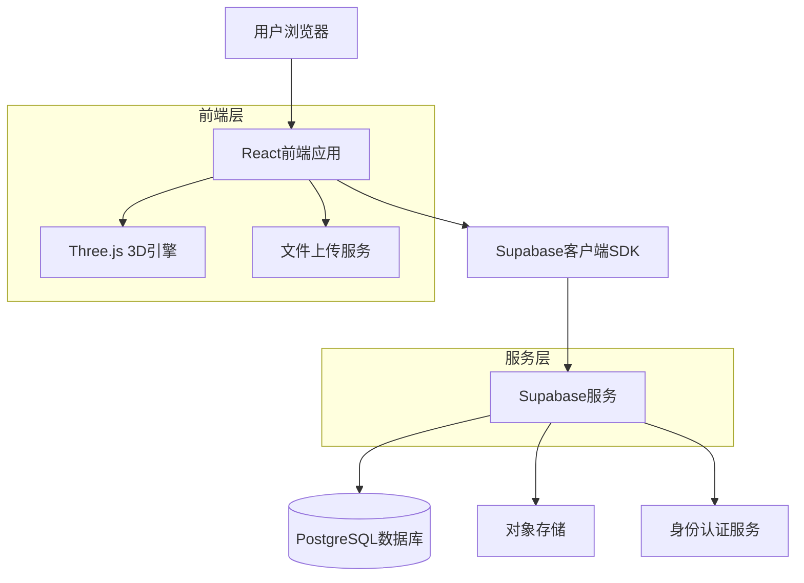
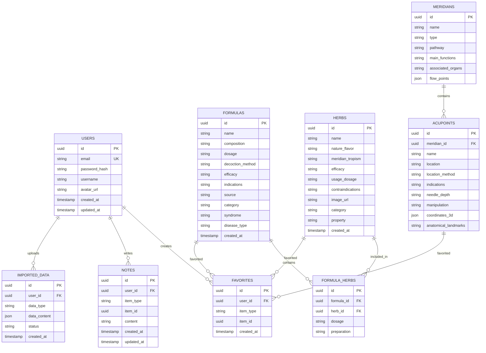

# 中医药辅助学习网页技术架构文档

## 1. 架构设计



## 2. 技术描述

- 前端：React@18 + TypeScript + TailwindCSS@3 + Vite
- 初始化工具：vite-init
- 3D可视化：Three.js + React Three Fiber
- 后端：Supabase（BaaS平台）
- 数据库：PostgreSQL（通过Supabase提供）
- 文件存储：Supabase Storage

## 3. 路由定义

| 路由 | 功能描述 |
|------|----------|
| / | 首页，导航入口 |
| /formulas | 方剂库列表页面 |
| /formulas/:id | 方剂详情页面 |
| /formulas/compare | 方剂对比页面 |
| /herbs | 中药库列表页面 |
| /herbs/:id | 中药详情页面 |
| /meridians | 经络图谱页面 |
| /meridians/:id | 经络详情页面 |
| /acupoints | 穴位查询页面 |
| /acupoints/:id | 穴位详情页面 |
| /favorites | 收藏夹页面 |
| /notes | 笔记管理页面 |
| /import | 数据导入页面 |
| /login | 用户登录页面 |
| /register | 用户注册页面 |
| /profile | 用户个人中心 |

## 4. API定义

### 4.1 核心API接口

#### 方剂相关API
```
GET /api/formulas
```
请求参数：
| 参数名 | 类型 | 必需 | 描述 |
|--------|------|------|------|
| category | string | 否 | 功效分类 |
| syndrome | string | 否 | 证候分类 |
| disease | string | 否 | 病种分类 |
| search | string | 否 | 搜索关键词 |
| page | number | 否 | 页码 |
| limit | number | 否 | 每页数量 |

#### 中药相关API
```
GET /api/herbs
```
请求参数：
| 参数名 | 类型 | 必需 | 描述 |
|--------|------|------|------|
| efficacy | string | 否 | 功效筛选 |
| meridian | string | 否 | 归经筛选 |
| property | string | 否 | 药性筛选 |
| search | string | 否 | 搜索关键词 |

#### 经络穴位API
```
GET /api/meridians
```
```
GET /api/acupoints
```

#### 收藏和笔记API
```
POST /api/favorites
```
```
POST /api/notes
```

#### 数据导入API
```
POST /api/import/herbs
```
```
POST /api/import/formulas
```

## 5. 数据模型设计

### 5.1 数据库实体关系图



### 5.2 数据定义语言（DDL）

#### 用户表
```sql
-- 创建用户表
CREATE TABLE users (
    id UUID PRIMARY KEY DEFAULT gen_random_uuid(),
    email VARCHAR(255) UNIQUE NOT NULL,
    password_hash VARCHAR(255) NOT NULL,
    username VARCHAR(100) UNIQUE NOT NULL,
    avatar_url TEXT,
    created_at TIMESTAMP WITH TIME ZONE DEFAULT NOW(),
    updated_at TIMESTAMP WITH TIME ZONE DEFAULT NOW()
);

-- 创建索引
CREATE INDEX idx_users_email ON users(email);
CREATE INDEX idx_users_username ON users(username);
```

#### 方剂表
```sql
-- 创建方剂表
CREATE TABLE formulas (
    id UUID PRIMARY KEY DEFAULT gen_random_uuid(),
    name VARCHAR(255) NOT NULL,
    composition TEXT NOT NULL,
    dosage TEXT,
    decoction_method TEXT,
    efficacy TEXT,
    indications TEXT,
    source VARCHAR(255),
    category VARCHAR(100),
    syndrome VARCHAR(100),
    disease_type VARCHAR(100),
    created_at TIMESTAMP WITH TIME ZONE DEFAULT NOW()
);

-- 创建索引
CREATE INDEX idx_formulas_name ON formulas(name);
CREATE INDEX idx_formulas_category ON formulas(category);
CREATE INDEX idx_formulas_syndrome ON formulas(syndrome);
CREATE INDEX idx_formulas_disease ON formulas(disease_type);
```

#### 中药表
```sql
-- 创建中药表
CREATE TABLE herbs (
    id UUID PRIMARY KEY DEFAULT gen_random_uuid(),
    name VARCHAR(255) NOT NULL,
    nature_flavor VARCHAR(255),
    meridian_tropism VARCHAR(255),
    efficacy TEXT,
    usage_dosage TEXT,
    contraindications TEXT,
    image_url TEXT,
    category VARCHAR(100),
    property VARCHAR(100),
    created_at TIMESTAMP WITH TIME ZONE DEFAULT NOW()
);

-- 创建索引
CREATE INDEX idx_herbs_name ON herbs(name);
CREATE INDEX idx_herbs_category ON herbs(category);
CREATE INDEX idx_herbs_property ON herbs(property);
```

#### 经络表
```sql
-- 创建经络表
CREATE TABLE meridians (
    id UUID PRIMARY KEY DEFAULT gen_random_uuid(),
    name VARCHAR(255) NOT NULL,
    type VARCHAR(50) NOT NULL, -- 'regular' 或 'extraordinary'
    pathway TEXT,
    main_functions TEXT,
    associated_organs TEXT,
    flow_points JSONB,
    created_at TIMESTAMP WITH TIME ZONE DEFAULT NOW()
);

-- 创建索引
CREATE INDEX idx_meridians_name ON meridians(name);
CREATE INDEX idx_meridians_type ON meridians(type);
```

#### 穴位表
```sql
-- 创建穴位表
CREATE TABLE acupoints (
    id UUID PRIMARY KEY DEFAULT gen_random_uuid(),
    meridian_id UUID REFERENCES meridians(id) ON DELETE CASCADE,
    name VARCHAR(255) NOT NULL,
    location TEXT NOT NULL,
    location_method TEXT,
    indications TEXT,
    needle_depth VARCHAR(50),
    manipulation TEXT,
    coordinates_3d JSONB,
    anatomical_landmarks TEXT,
    created_at TIMESTAMP WITH TIME ZONE DEFAULT NOW()
);

-- 创建索引
CREATE INDEX idx_acupoints_meridian ON acupoints(meridian_id);
CREATE INDEX idx_acupoints_name ON acupoints(name);
```

#### 收藏表
```sql
-- 创建收藏表
CREATE TABLE favorites (
    id UUID PRIMARY KEY DEFAULT gen_random_uuid(),
    user_id UUID REFERENCES users(id) ON DELETE CASCADE,
    item_type VARCHAR(50) NOT NULL, -- 'formula', 'herb', 'acupoint'
    item_id UUID NOT NULL,
    created_at TIMESTAMP WITH TIME ZONE DEFAULT NOW(),
    UNIQUE(user_id, item_type, item_id)
);

-- 创建索引
CREATE INDEX idx_favorites_user ON favorites(user_id);
CREATE INDEX idx_favorites_item ON favorites(item_type, item_id);
```

#### 权限设置
```sql
-- 授予匿名用户基本读取权限
GRANT SELECT ON formulas TO anon;
GRANT SELECT ON herbs TO anon;
GRANT SELECT ON meridians TO anon;
GRANT SELECT ON acupoints TO anon;

-- 授予认证用户完整权限
GRANT ALL PRIVILEGES ON ALL TABLES TO authenticated;
GRANT ALL PRIVILEGES ON ALL SEQUENCES TO authenticated;
```

## 6. 3D可视化技术方案

### 6.1 技术选型
- 3D引擎：Three.js + React Three Fiber
- 人体模型：使用GLTF格式的3D模型
- 交互控制：OrbitControls用于视角控制
- 标注系统：CSS2DRenderer用于穴位标注

### 6.2 功能实现
- 经络路径可视化
- 穴位3D定位
- 交互式旋转缩放
- 热点点击交互
- 分层显示控制

## 7. 数据导入功能

### 7.1 支持格式
- Excel文件（.xlsx, .xls）
- CSV文件（.csv）
- JSON文件（.json）

### 7.2 数据验证
- 格式验证
- 完整性检查
- 重复数据检测
- 数据类型校验

### 7.3 导入流程
1. 文件上传
2. 格式解析
3. 数据验证
4. 预览确认
5. 批量导入
6. 结果反馈

## 8. 安全性考虑

### 8.1 数据安全
- 用户密码加密存储
- API访问权限控制
- 数据备份策略

### 8.2 文件上传安全
- 文件类型检查
- 文件大小限制
- 病毒扫描
- 存储隔离

## 9. 性能优化

### 9.1 前端优化
- 组件懒加载
- 图片懒加载
- 虚拟滚动
- 缓存策略

### 9.2 数据库优化
- 索引优化
- 查询优化
- 分页处理
- 连接池配置

## 10. 部署方案

### 10.1 前端部署
- 静态资源托管（Vercel/Netlify）
- CDN加速
- 域名配置
- HTTPS证书

### 10.2 后端部署
- Supabase云服务
- 自动扩缩容
- 监控告警
- 日志管理